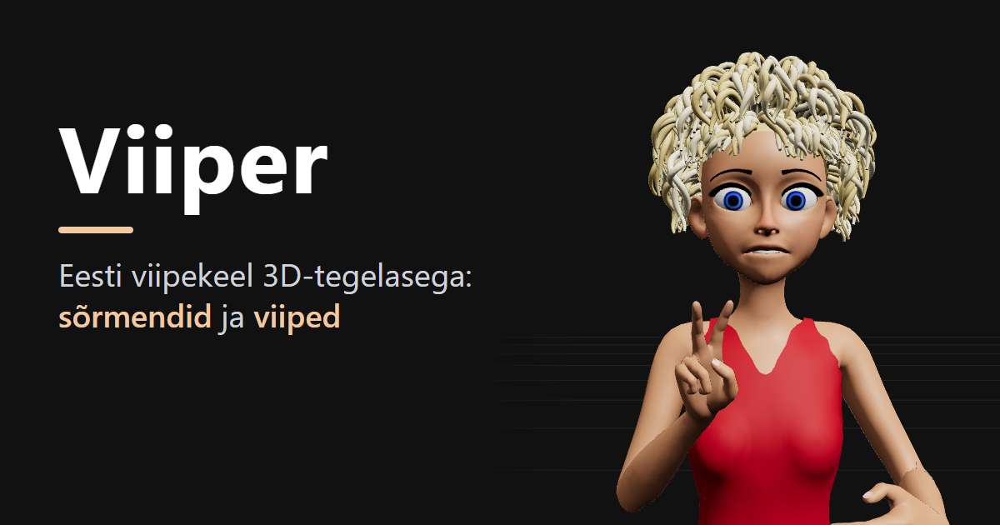

# Viiper



A 3D signing avatar that shows the **Estonian finger-spelling alphabet** (*sõrmendid*) together with the matching **mouth shape** for each letter. Press a letter and the character's right hand forms the sign while its lips form the viseme; release it and the mouth relaxes while the hand holds the sign (Esc returns it to a standby pose).

The page is public and runs in the browser ([three.js](https://threejs.org/), [Vite](https://vite.dev/)). A small Node backend (Express, TypeScript, SQLite) keeps the signs and the **accounts**: anyone can watch the signs, signed-in users can edit and add them.

## Getting started

Requires Node.js 22 or newer. A monorepo (npm workspaces): the frontend is in [client/](client/), the backend in [server/](server/).

```bash
npm install
npm run user -- add <name> --role admin   # the first account (asks for a password)
npm run dev       # API server (:3001) + Vite dev server (:5173, proxies /api to the server)
npm test          # server tests
npm run build     # client -> client/dist, server -> server/dist
npm start         # production: the server serves client/dist and the API (NODE_ENV=production)
```

Open the URL Vite prints (usually http://localhost:5173). Without the server the page still works: it falls back to the signs it was built with (but nothing can be saved).

### Running under pm2

[ecosystem.config.cjs](ecosystem.config.cjs) starts the built server (`server/dist`, which also serves `client/dist`) as one process named `viiper`:

```bash
npm ci && npm run build
ADMIN_USER=<name> ADMIN_PASSWORD=<password> pm2 start ecosystem.config.cjs   # the two variables only on the very first start
pm2 save && pm2 startup                                                      # once per host: start on boot
# later updates:
git pull && npm ci && npm run build && pm2 reload viiper
```

Keep it to one instance (SQLite is one file, the login limits live in memory). Put nginx or Caddy with HTTPS in front (the session cookie is `Secure`) and keep `TRUST_PROXY=1`. Back up the database file, `DB_PATH` (default `server/data/viiper.db`).

### Configuration (environment variables of the server)

| Variable | Default | |
| --- | --- | --- |
| `PORT` | `3001` | |
| `DB_PATH` | `server/data/viiper.db` | the SQLite file (git-ignored) |
| `NODE_ENV` | | `production` serves `client/dist`, sets `Secure` cookies and HSTS |
| `COOKIE_SECURE` | on in production | `0` to test production mode over plain http |
| `TRUST_PROXY` | off | set (e.g. `1`) behind a reverse proxy, so the visitor's IP is read from `X-Forwarded-For` (login rate limits need it) |
| `ADMIN_USER`, `ADMIN_PASSWORD` | | creates the first admin on start when there are no accounts yet (handy on a new host) |
| `SESSION_DAYS` | `14` | |
| `ALLOWED_ORIGINS` | | extra origins (comma separated) allowed to make changes; the page's own origin always is |
| `CLIENT_DIST`, `DATA_DIR` | `client/dist`, `client/src/data` | |

## Using it

- **Hold a letter key** (or press a button in the letter panel) to show that letter's hand sign and mouth shape. Release it and the mouth relaxes, while the hand stays in the sign until you press another letter or **Esc** (back to standby).
- **Word signs** (typed in the text box) get mouthing too: the mouth goes through the word's letter shapes while the hand signs it (for an alias such as "PALJU ÕNNE", the words as typed).
- Supported letters: `A–Z` as used in Estonian, including `Š Ž Õ Ä Ö Ü`. Some letters, such as `X` and `Q`, are two-handed.
- **Drag** to orbit, **scroll** to zoom. The *Vaade* panel has zoom buttons, and camera presets (front, back, sides, top, three-quarter).
- **Word signs** live in [client/src/data/words.json](client/src/data/words.json): *tere, head aega, aitäh, palun, vabandust, jah, ei, hea, hästi, õnnitlema* (also typed as *palju õnne*), and the topic *Inimesed ja asesõnad*: *mina, sina, tema, meie, teie, teie viisakusvorm, nemad* (also *nad*), *inimene, nimi, ise, kõik*, and the question words *kes, mis, milline, kus, kuhu, kust, millal, miks, kuidas, kui palju* (also *mitu*), and the family and close ones *ema, isa, laps, poeg, tütar, vend, õde, vanaema, vanaisa, sõber*, and communication and learning *viipekeel, viiplema, kurt, kuulja, aru saama, teadma, küsima, vastama, kordama, õppima*, wishes and needs *tahtma, vajama, saama* (also *suutma*), *oskama, aitama, ootama, meeldima, armastama, andma, võtma*, and everyday actions *sööma, jooma, magama, ärkama, minema, tulema, tegema, töötama, mängima, pesema*, and the words that build a sentence *olema* (also *on*), *pole* (also *ei ole*), *ja, või, aga, ka, veel, juba, ainult, mitte, sest, kui, siis*, and the topics time, calendar, places, food and drink, feeling and health, and qualities: *praegu, täna, homme, eile, hommik, päev, õhtu, öö, enne, pärast, esmaspäev, teisipäev, kolmapäev, neljapäev, reede, laupäev, pühapäev, nädal, kuu, aasta, kodu, kool, lasteaed, töökoht, pood, haigla, apteek, tualett, õu, linn, vesi, piim, kohv, tee, leib, puder, supp, liha, kala, õun, rõõmus, kurb, väsinud, haige, terve, valu, nälg, janu, arst, ravim, suur, väike, halb, uus, vana, soe, külm, kiire, aeglane, siin, seal, üleval, all, sees, väljas, vasakul, paremal, lähedal, kaugel, telefon, arvuti, internet, video, raamat, paber, pliiats, laud, tool, uks, raha, hind, ostma, maksma, kallis, odav, buss, auto, pilet, peatus* (see the `signs` keys in words.json). Type the whole word or phrase into the text box and it is shown as one sign instead of letter by letter. While typing, a suggestion list of the known words appears (accents ignored; ↑/↓ and Enter or Tab, or a click, complete the word). They follow the EKI sign-language dictionary videos; the hand motions (waves, finger folding, palm turning, wrist nods) are `motion` paths, described in [client/src/signing/hands.js](client/src/signing/hands.js).
- The eyes follow the mouse cursor (and look at the camera when the cursor leaves the page).
- All panels are draggable by their title bar and remember where you left them.

### Models

The default model is `client/src/assets/models/Kati.glb`. Put more `.glb` files in that folder and load one with the `model` query parameter (the file name without `.glb`):

```
http://localhost:5173/?model=MyModel
```

Two rig types are supported (see [client/src/character/rigs.js](client/src/character/rigs.js)): **Rigify** (bone-based face) and **Character Creator** (face made of shape keys). The rig is detected automatically from the bone names. Only Kati, a Character Creator model, is in the repository; the Rigify code (lip bones, eyelid domes, the `?openAngle` / `?closedAngle` / `?scale` parameters) has no model to run against at the moment.
If the model fails to load, a placeholder cube is shown.

### Debug query parameters

| Parameter | Effect |
| --- | --- |
| `?sign=B` | Freeze the hand in that letter's (or word's) sign; `&at=0..1` also holds its motion at that fraction |
| `?viseme=O` | Freeze the mouth in that viseme |
| `?face=1` / `?face=mouth` | Frame the face / the mouth |
| `?guard=0` | Turn the body, hand-to-hand and finger guards off (arms may go into the trunk and each other, the thumb through the fingers, again) |
| `?colliders=1` | Draw the body's collision shape and the capsules of the hands and forearms (red where two are inside each other) |
| `?audit=1` | Show every sign and write how deep the hands' capsules go into each other into `#audit-result` (also `window.__app.audit()`; `window.__app.show('PALUN', 0)` shows one sign) |
| `?gaze=0` | Keep the eyes from following the mouse cursor |
| `?blink=0..1` | Freeze the eyelids at that closure |
| `?openAngle=`, `?closedAngle=`, `?scale=` | Override the eyelid dome (Rigify) |

`window.__app` exposes the scene, rig, hands, mouth and tweaks in the browser console for debugging.

## Fine-tuning signs (*Peenhäälestus*)

Signed-in users get the **Peenhäälestus** button (top right, under the account button; the editor is only downloaded then). It opens one horizontal window along the bottom of the screen: blocks with the settings on top, the motion timeline below. The scene moves up to stay above it; drag the window's top edge to change its height. *▾ Seaded* (in the bar) hides the setting blocks and *▾ Ajajoon* the timeline's tracks (its head with the play button stays); the window shrinks by as much and the scene gets the room. Both are remembered. It remembers whether it was open.

**Blocks**

- **Märk:** search for a letter or a word (accents don't matter, Enter picks the first hit) or click one in the list; a dot marks signs with unsaved changes. *Parem käsi* / *Vasak käsi* choose which hand the blocks and the timeline edit (the left hand can be added to or removed from a sign). *Ooteasend tähtede vahel* keeps the hands in the standby pose between signs. *Kokkupõrke kaitse (keha, käed, sõrmed)* turns the body guard, the hand-to-hand guard and the finger guard (the thumb and fingers of a hand are bent apart, overlaps of up to 2 mm are left) on and off (they start on; off, a bone can be posed freely, the same as `?guard=0`), *Näita kolliderid* draws the collision shapes (the same as `?colliders=1`).
- **Uus märk** (in the *Märk* block): type a name (upper-cased; 2–40 letters, digits, spaces or hyphens; a name that is taken is refused), optionally tick *Alusta valitud märgi koopiast* to start from the selected sign's definition and bone tweaks, and press *＋ Lisa märk*. The new sign is a word sign, selected at once and edited like any other; until it is saved it can be removed again with *Kustuta see uus märk*. Adding or removing a sign starts the undo history over. *Salvesta* adds it to the word signs on the server and reloads the page, so the text box suggestions and the sign list (*Viiped*) pick it up too.
- **Käe asend:** the named orient (`dir`) plus this sign's own changes to it: wrist position (`reach`), elbow direction (`pole`), which way the fingers and thumb point, the wrist bend limit. Changes are kept in the sign as `orient` and never touch other signs that use the same named orient. It also shows *Randme väänd*, the twist of the hands against the forearms.
- **Sõrmed:** curl, spread and knuckle bend of each finger and the thumb pose. (The finger-spelling letters have no finger data, only bone tweaks: *Määra sõrmeandmed* adds it.)
- **Luu peenhäälestus:** the rotation of any bone (arms and fingers, face and lips, body) and the weight of any face shape key. Pick a group and a bone (from the list, or by clicking its marker in the scene) and use the sliders. Tweaks apply per sign for the face and the signing arm, to the standby pose for the other arm, and always for the body. Optionally mirror the edit to the opposite side.
  Below the sliders are the bone's **Pöörde piirid** (rotation limits, the same for every sign): a min and a max in degrees per axis, measured from the rest pose, the same axes as the *Pööre* sliders (Euler XYZ in the bone's own axes; blank = free; a range need not contain 0, a bone whose range lies away from its rest pose is held at the nearest end; Y only reaches ±90). *⇤* / *⇥* take the bone's current angle as the min / max, the angle on the right turns red while the limit holds the bone back, *Piirid kehtivad* switches the clamping off for free posing, and *Eemalda luu piirid* clears the bone. For a finger bone (index to little finger) the block also shows the **Sõrmeliigese piirid**: the curl (P), spread (L) and twist (V) limits of that joint kind (MCP, PIP or DIP), shared by that joint of every finger on both hands (`finger` in the same file); the thumb has no such table, limit its bones with X/Y/Z. The arms' twist helper bones (`…Twist01`, `…Twist02`) only turn about Y, their long axis: X and Z are locked for their limits. Every bone of the model can have limits; they apply to the final pose in every sign and motion (so also to what the hand code or the IK does), and the *Pööre* sliders stop at them: a bone that nothing else poses simply gets the limit as the slider's end; for the arms and fingers (posed by the hand code first) the slider stops at the point where the limit starts to hold the bone, for as long as it is being dragged. Saved with *Salvesta* (the `limits` document of the database).
- **Kopeeri teisest märgist:** copy bone tweaks from another sign (whole sign, the chosen group or the chosen bone), with one step of undo.

**Timeline (*Liikumine*)** shows the sign's motion path, one track per channel (`x y z tilt flex roll curl outer`, see [client/src/signing/hands.js](client/src/signing/hands.js)). The character holds the sign at the playhead while you edit; *▶ Mängi* plays it. The points of the path are the dots:

- drag a dot up or down to change that channel of the point; the number fields next to *Punkt n/m* set it exactly;
- click or drag in the ruler or between the tracks to move the playhead; double-click a track (or *+ Punkt*) to add a point there; *− Punkt* removes the selected one;
- the points sit where the character reaches them: each segment gets a share of the *Kestus* in proportion to its length, so changing a point also moves the ones after it. *Hajutus* (`stagger`) lets the fingers take the curl channel one after the other.

**Undo:** *↶ Tagasi* / *↷ Uuesti* in the bar (or Ctrl+Z, Ctrl+Shift+Z / Ctrl+Y) step through every edit, sign definitions and bone tweaks alike, and go back to the sign and hand that was edited. A slider drag or a typed number is one step: it is recorded when the slider is let go or the field loses focus. *Lae failist* can be undone too; saving to the files starts the history over.

Edits are kept in `localStorage` as a working copy. To publish them, press **Salvesta**: the changed signs, the body's tweaks and the limits go to the server in one request and everyone sees them at once (the page reads the signs from the server on every load). *Lähtesta märk* sends the sign's definition back to what the server held when the page loaded; *Lae uuesti* drops the whole working copy.

**Two editors at once:** every sign has a version, and a save carries the version it was edited from. If somebody saved the same sign meanwhile, the save is refused whole (*Keegi teine salvestas vahepeal: …*) and nothing is overwritten; reload the page. After a reload your working copy of the *other* signs is kept (it is per sign), the conflicting sign is replaced by the version that was saved. Every save is also kept in the history table (who, when, the whole sign: `GET /api/history/<SIGN>`).

### Fixing a sign that looks wrong

1. **Open it frozen:** `http://localhost:5173/?sign=HEA` (or another letter / word) holds the sign still; `&at=0.5` also holds its motion half way. `?colliders=1` draws the body shape the arms are kept out of.
2. **The sign itself** (where the hand is, the elbow, the fingers, the motion): the *Käe asend*, *Sõrmed* blocks and the timeline of *Peenhäälestus*. **Small things** (a single finger, the thumb, the hand's angle): its *Luu peenhäälestus* block. Pick the sign and bone, adjust, save.
3. **The arm looks twisted:** *Käe asend* shows *Randme väänd* (the hand's twist against the forearm). Up to about ±100° is natural (palm to the body is about 0°, palm facing out about 90°); beyond that the forearm looks wrung. The cause is nearly always the elbow's position: change `pole` of the sign's orient in [client/src/data/shared.json](client/src/data/shared.json) (the direction the elbow points; `[-1, -0.6, 0.2]` = out and down) and watch the number. The same file holds `reach` (where the wrist is, in arm lengths from the shoulder) and `finger` / `thumb` (which way the hand points). Hand angles that fight the forearm direction also bend the wrist; keep `finger` roughly along the line from the elbow to the wrist.
4. **The hand or elbow is inside the body:** the body collision usually moves it, but a hand that has to be pushed a lot means `reach` is wrong (more `z` = further forward).
5. **Motion:** `motion.path` in the sign (words.json) – see the comment in [client/src/signing/hands.js](client/src/signing/hands.js) for the numbers.

## Accounts

Anyone can open the page and watch the signs; **an account is needed to change them**. There is no self-registration: an admin makes the accounts.

- The first admin: `npm run user -- add <name> --role admin` (asks for the password), or `ADMIN_USER` / `ADMIN_PASSWORD` in the server's environment on a new host.
- Roles: **editor** (*toimetaja*) edits signs; **admin** also manages accounts.
- The account button (top right) signs in and out, changes one's own password and, for admins, opens *Kasutajad*: add an account, change a role, set a new password, disable or delete. The last active admin cannot be removed. A disabled account, a changed password and a deleted account end that account's sessions.
- The same from the command line: `npm run user -- list | add | passwd | role | disable | enable | delete` (see [server/src/cli/user.ts](server/src/cli/user.ts)).
- Passwords: at least 10 characters, stored as salted scrypt hashes. A sign-in sets an `HttpOnly`, `SameSite=Lax` (and, in production, `Secure`, `__Host-`) cookie holding a random token; the database keeps only the token's SHA-256, so a leaked database cannot be used to sign in. Sessions last 14 days of use.
- Wrong passwords are limited per IP and per IP + account (429 for 15 minutes). Every change request must be JSON and, when the browser says where from, come from the page's own origin (cross-site request forgery).

## Where the signs are kept

In **SQLite** ([server/data/viiper.db](server/data/), git-ignored), as documents: one row per sign (its definition and its bone tweaks as JSON, plus a version), a few settings rows (aliases, body tweaks, limits), a history table and the accounts. The reasons: several editors at once need atomic saves and conflict detection, every change needs an author and a history, and a deployed site cannot write into git-tracked files or be rebuilt on every edit. A sign is a nested, loosely shaped document that is always read and written whole, so it is stored as one JSON value instead of being split into tables.

The JSON files in [client/src/data/](client/src/data/) are still there, in three roles:

- **seed:** an empty database is filled from them on the first start (`npm run seed`);
- **offline fallback:** the page is built with them, so it still shows signs when the server cannot be reached;
- **export:** `npm run export` writes the database back into them in the same compact, diff-friendly layout (byte-identical when nothing was edited), so the signs can be committed to git, reviewed in diffs and become the next build's fallback. Do this now and then; the database file is the thing to back up (`server/data/viiper.db`, e.g. with `sqlite3 viiper.db ".backup copy.db"`).

`shared.json` (hand orients, visemes, rig data) is code-like configuration and stays a bundled file only.

### API

| | | |
| --- | --- | --- |
| `GET /api/data` | public | `{ fingerspelling, words, limits, versions }`, the shape of the JSON files (notes only for signed-in users) |
| `PUT /api/data` | signed in | `{ signs: { KEY: { def?, tweaks?, base, create? } }, global?: { tweaks, base }, limits?: { bones, finger, base } }`; all or nothing, 409 + `conflicts` when a `base` version is stale |
| `GET /api/history/:target` | signed in | the saves of a sign, `*global` or `*limits` |
| `POST /api/auth/login`, `/logout`, `/password`; `GET /api/auth/me` | | sessions |
| `GET/POST /api/users`, `PATCH/DELETE /api/users/:id` | admin | accounts |

## Project layout

```
client/                 the frontend (Vite, three.js)
  index.html              entry page (and the loading screen)
  vite.config.js          Vite config: the /api proxy for dev, and a build step that drops the JSON `note` fields
  public/                 static files served as-is
  src/
    main.js               starts the stage, the panels, the account button and the model
    auth.js               the signed-in user and the API calls
    util.js               small shared helpers (canon, fingerprint, fold)
    assets/models/        .glb character models (bundled by Vite)
    app/                  wiring: model loading, the character, the render loop, the editor dock (loaded only when signed in)
    data/
      store.js            the signs the page runs on: from the server, or the bundled JSON files when it cannot be reached
      shared.json         data shared by all kinds of signs: hand orientations,
                          thumb poses, visemes, letter → viseme table, per-rig data
      fingerspelling.json the letters (mostly bone tweaks; a few have motion) and the standby pose
      words.json          word signs, same format as the letters (key = upper-case word)
      limits.json         rotation limits of single bones (set in the fine-tuning window)
    character/            the model's face and eyes
      rigs.js             skeleton profiles (Rigify, Character Creator)
      morphs.js           shared shape-key layer (mouth, blink and tweaks add up)
      mouth.js            visemes
      blink.js            eyelid blinking
      gaze.js             eyes follow the mouse cursor
    signing/              finger-spelling
      hands.js            poses and arm IK
      tweaks.js           hand-tuned bone / shape offsets layered on top of poses
      limits.js           joint limits (limits.json): the fingers and any single bone
      signDefs.js         sign definitions edited in the fine-tuning window (baseline, working copy)
      signFormat.js       the fields of a sign and the rule for a new sign's name (the server has the same rules in signs/validate.ts)
      twist.js            shares the wrist twist over the forearm (skin)
      body.js             trunk / head collision shape (keeps arms out of the body)
    ui/                   panels
      draggable.js        draggable, position-remembering panels
      panels.css          the look of the floating panels (shared box and title bar, then each panel)
      letterPanel.js      letter buttons
      textPanel.js        text box: typed text is signed letter by letter or word by word, with suggestions
      viewControls.js     camera panel
      signBrowser.js      sign viewer: search, alphabetical list, A-Z strip, repeat checkbox
      splash.js           the loading screen's progress bar (its markup is in index.html)
      account.js          the account button: sign in, change password, manage accounts (admin)
      fineTuner.js        fine-tuning window: sign search, hand pose, fingers, bones, motion timeline, save
server/                 the backend (Express, TypeScript, SQLite via better-sqlite3)
  src/index.ts            start: opens the database, seeds it, creates the first admin, listens
  src/app.ts              the Express app: security headers, sessions, routes, the built client in production
  src/db.ts               schema and migrations (PRAGMA user_version)
  src/auth/               password hashing (scrypt), sessions, accounts
  src/routes/             auth, users, data
  src/signs/              the sign store (read, save with versions, history), validation, the JSON file layout
  src/cli/                npm run seed | export | user
  test/                   API tests (node:test, in-memory database)
scripts/dev.mjs         npm run dev: server and client together
```

### How a sign is described

`client/src/data/shared.json` and `client/src/data/fingerspelling.json` are the source of truth and can be edited by hand.

In `shared.json`:

- `orient`: where the hand is held and which way it points (world directions and a wrist target relative to the shoulder).
- `thumbPoses`: thumb joint rotations.
- `visemes` and `letters`: mouth shapes and which letter uses which.
- `rigs`: per-rig overrides (thumb poses, visemes).

In `fingerspelling.json`:

- `signs`: per letter (and `ootel`, the standby pose), mostly just the `tweaks` made in the fine-tuning window: the rotation of arm and finger bones, which is what poses the hand. `left` (an empty `{}` is enough) lets the other hand take part in a letter. A letter can carry the same finger data as a word sign (`curl`, `spread`, `knuckle`, `thumb`, `dir`, `orient`), as U does; *Määra sõrmeandmed* in the editor adds it from the current pose. `motion` moves the hand (Z, Ž, Ä).
- `global`: tweaks that always apply (body).

`words.json` has the word signs, which are described by finger data (`curl` 0 straight to 1 fully curled, optional `spread` and `knuckle`, a thumb pose, an `orient` named in `dir`) and a `motion`, plus optional `tweaks`.

Details are in the header comments of [client/src/signing/hands.js](client/src/signing/hands.js), [client/src/character/mouth.js](client/src/character/mouth.js) and [client/src/signing/tweaks.js](client/src/signing/tweaks.js).

## Limits and collision

Two safety nets run last every frame, on top of the signs and the hand-tuned offsets, so a new sign can't break the model:

- **Finger joint limits** ([client/src/signing/limits.js](client/src/signing/limits.js), ranges in `finger` of [limits.json](client/src/data/limits.json)): every finger joint is clamped in curl (no bending backwards), spread and twist. The ranges are wide enough that none of the existing letters changes; they only catch extreme values.
- **Body collision** ([client/src/signing/body.js](client/src/signing/body.js), shape in `rigs.<rig>.body` of shared.json): the trunk is a stack of ellipses and the head a sphere. If the wrist, palm or fingers are inside, the hand is moved out (keeping its orientation) and the elbow is turned about the shoulder-wrist line until the arm is clear. A rig without a `body` shape has no collision.

`?colliders=1` draws the shape, `?guard=0` turns the collision off. Not covered: hand against hand, the thumb's joint limits, wrist and elbow angle limits.

## Notes

- Models must be uncompressed or Meshopt-compressed (Kati is). Draco-compressed ones are not supported: to add that, import `DRACOLoader` in [client/src/main.js](client/src/main.js) and pass `new DRACOLoader()` to the loader with `setDRACOLoader` (three.js brings its decoder files along and Vite bundles them, no CDN needed; they add about 1.3 MB to `dist/`).
- The editor UI is in Estonian.
